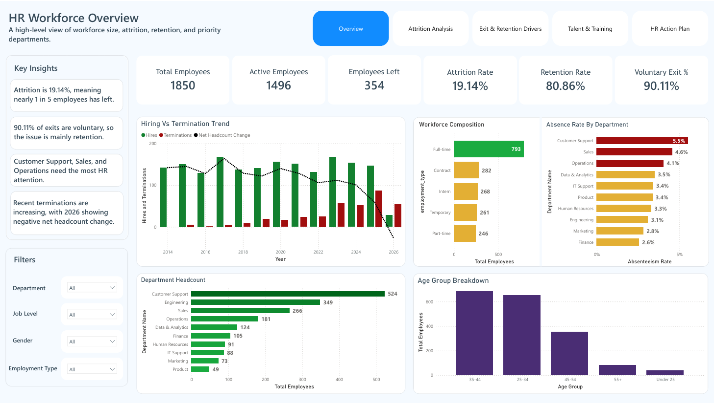
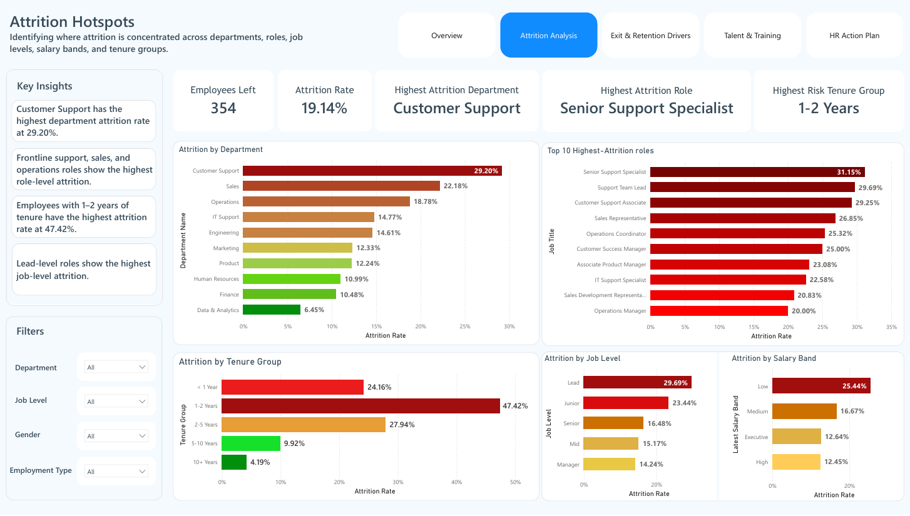
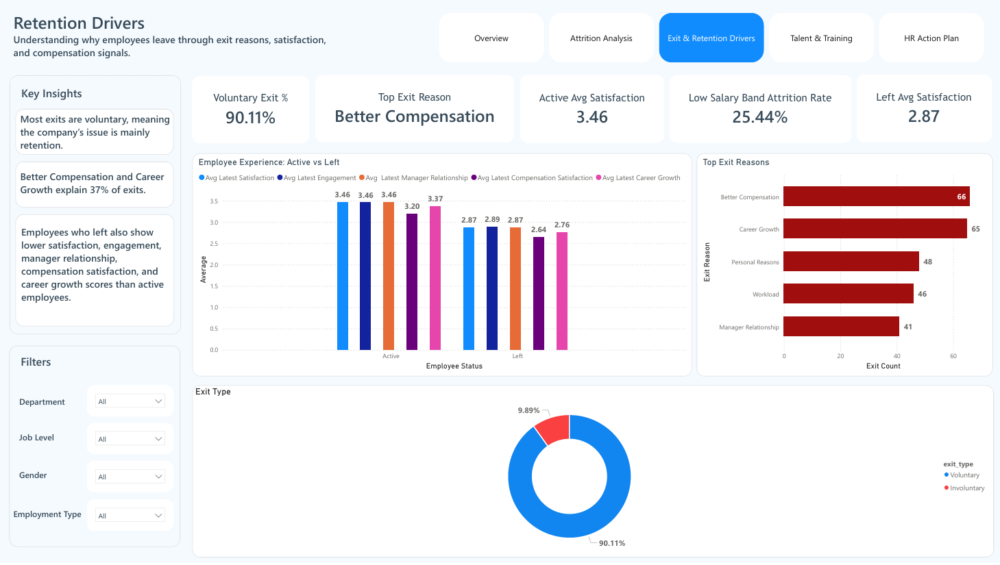
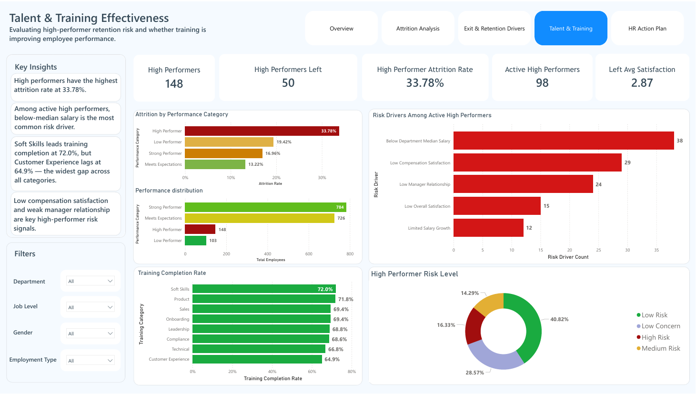
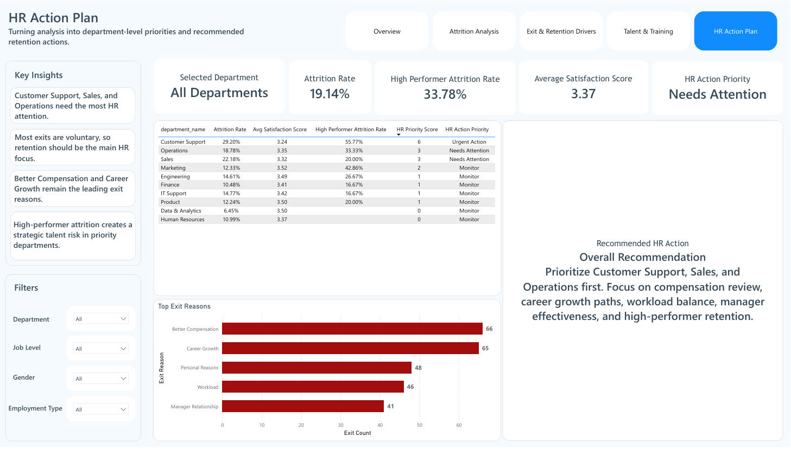

# HR Workforce Attrition & Retention Analysis

**End-to-end HR analytics portfolio project** — raw data to executive dashboard using Python, PostgreSQL, and Power BI.

> **Business question:** Where is attrition happening, why are employees leaving, and what should HR prioritize next?

---

## Dashboard Preview

| Page | Preview |
|---|---|
| HR Workforce Overview |  |
| Attrition Hotspots |  |
| Retention Drivers |  |
| Talent & Training |  |
| HR Action Plan |  |

> Export each Power BI page as PNG (File → Export → Export to PNG) and place files in `images/`. GitHub renders them inline.

---

## Key Findings

| Metric | Value |
|---|---|
| Total Employees | 1,850 |
| Attrition Rate | **19.14%** — nearly 1 in 5 employees has left |
| Voluntary Exit % | **90.11%** — a retention problem, not a performance issue |
| Highest Attrition Dept | **Customer Support** at 29.20% |
| Highest Risk Tenure | **1–2 years** at 47.42% attrition rate |
| Top Exit Reason | **Better Compensation** (66 exits, 18.6%) |
| High Performer Attrition | **33.78%** — highest of any performance category |
| 2026 Net Headcount | **−26** — terminations exceeded hires for the first time |

---

## Business Problem

The company is experiencing employee turnover, but leadership needs to understand whether attrition is isolated or part of a broader retention problem. HR leadership needs answers to:

- How serious is the attrition problem overall?
- Which departments, roles, and employee groups are most affected?
- Are employees leaving voluntarily or involuntarily?
- What are the main reasons employees leave?
- Are high performers at risk?
- Are training programs actually improving employee performance?
- What actions should HR prioritize first?

---

## Project Architecture

```
Raw CSVs  →  Python Profiling  →  Python Cleaning  →  Clean CSVs  →  PostgreSQL (Silver)  →  Power BI
```

| Phase | Tool | Output |
|---|---|---|
| Data Profiling | Python (Pandas) | 5 profiling reports (CSV) |
| Data Cleaning | Python (Pandas) | 10 clean CSVs |
| Database Layer | PostgreSQL — Silver Schema | Star schema, FK constraints, 17 indexes |
| Business Analysis | SQL (16 queries, 7 sections) | Insight comments per query |
| Dashboard | Power BI (5 pages) | Decision-oriented dashboard |
| Presentation | PowerPoint | Executive findings deck |

---

## Architectural Decision — Why Silver Only (No Gold Layer)

This project uses a **single Silver schema** rather than a full Bronze → Silver → Gold medallion architecture. This was a deliberate choice, not an oversight.

**In a standard medallion architecture:**
- **Bronze** — raw data landed as-is, no transformations
- **Silver** — cleaned, validated, standardized, star schema
- **Gold** — pre-aggregated business-ready views built on Silver, consumed directly by BI tools

**Why Silver only here:**

The goal of this project is to demonstrate **analytical SQL querying skill directly on a clean, normalized schema** — not to pre-aggregate results into Gold views that a BI tool would simply `SELECT *` from.

All 16 business analysis queries run directly against `silver.*` tables and use advanced SQL techniques inline — window functions, multi-CTE chains, conditional aggregation, and statistical functions — making every derivation visible and traceable.

Building a Gold layer would have moved this logic into static views, hiding the SQL skill behind an abstraction. For a portfolio project, Silver is the deliberate stopping point.

**When a Gold layer would be appropriate:** In a production environment serving multiple analysts or a high-traffic BI tool, Gold views would standardize metric definitions and improve query performance. That context doesn't apply here.

---

## Repository Structure

```
hr_analytics_project/
│
├── data/
│   ├── raw/                          # Original source files (do not edit)
│   │   ├── raw_employees.csv
│   │   ├── raw_departments.csv
│   │   ├── raw_job_roles.csv
│   │   ├── raw_salaries.csv
│   │   ├── raw_performance_reviews.csv
│   │   ├── raw_satisfaction_surveys.csv
│   │   ├── raw_training_records.csv
│   │   ├── raw_attendance.csv
│   │   ├── raw_attrition_exit_interviews.csv
│   │   └── raw_department_history.csv
│   │
│   ├── profile/                      # Output of 01_data_quality_profile.ipynb
│   │   ├── table_profile.csv
│   │   ├── column_profile.csv
│   │   ├── date_quality.csv
│   │   ├── numeric_quality.csv
│   │   └── category_values.csv
│   │
│   └── clean/                        # Output of 02_clean_hr_data_FIXED.ipynb
│       ├── dim_departments.csv
│       ├── dim_job_roles.csv
│       ├── dim_employees.csv
│       ├── fact_salaries.csv
│       ├── fact_performance_reviews.csv
│       ├── fact_satisfaction_surveys.csv
│       ├── fact_training_records.csv
│       ├── fact_attendance.csv
│       ├── fact_attrition_exit_interviews.csv
│       ├── fact_department_history.csv
│       └── cleaning_summary.csv
│
├── notebooks/
│   ├── 001_data_quality_profile.ipynb  # Profiling: nulls, dates, numerics, categories
│   └── 002_clean_hrdata.ipynb   # Cleaning: standardization, normalization, export
│
├── sql/
│   ├── 01_CREATE_IMPORT_VALIDATE.SQL   # Schema, COPY, FK, indexes, 12 validation checks
│   └── 02_HR_BUSINESS_ANALYSIS.SQL     # 16 business queries across 7 analytical sections
│
├── dashboard/
│   └── HR_Analytics_Dashboard.pbix
│
├── presentation/
│   └── HR_Analytics_Executive_Findings.pptx
│
├── images/                           # Dashboard screenshots for README
│   ├── dashboard_overview.png
│   ├── attrition_hotspots.png
│   ├── retention_drivers.png
│   ├── talent_training.png
│   └── hr_action_plan.png
│
└── README.md
```

---

## Dataset Overview

| Table | Rows | Description |
|---|---|---|
| raw_employees | 1,900 | Employee master — demographics, status, department, role |
| raw_departments | 14 | Department dimension with region and business unit |
| raw_job_roles | 35 | Job role dimension with levels and salary band ranges |
| raw_salaries | 5,132 | Salary history — multi-currency, multiple records per employee |
| raw_performance_reviews | 4,432 | Performance scores and goals — up to 5 reviews per employee |
| raw_satisfaction_surveys | 3,990 | 6-dimension satisfaction surveys |
| raw_training_records | 7,344 | Training completion and scores by program and category |
| raw_attendance | 54,660 | Daily attendance, absence flags, and late minutes |
| raw_attrition_exit_interviews | 374 | Exit type, exit reason, and interview scores |
| raw_department_history | 2,123 | Department transfer and role change history |
| **Total** | **80,004** | |

---

## Phase 1 — Data Profiling (`01_data_quality_profile.ipynb`)

Profiles all 10 raw tables before any cleaning. Outputs 5 CSV reports.

**What it checks:**
- Row counts, duplicate rows, blank cell percentage per table
- Missing value count and percentage per column
- Date validity (parseable, in-range, not future)
- Numeric validity (parseable, min/max/avg)
- Categorical consistency (value counts, variant spellings)

**Key issues found:**
- `remote_status`: 321 nulls (16.9%)
- `marital_status`: 285 nulls (15.0%)
- `manager_id`: 286 nulls — expected for senior leadership
- `completion_date` in training: 2,732 nulls — correctly null for incomplete records
- `pay_frequency`: inconsistent labels (`ANNUAL`, `annual`, `Biweekly`, `Yearly`)
- `performance_score`: values found outside the valid 1–5 range

---

## Phase 2 — Data Cleaning (`02_clean_hr_data_FIXED.ipynb`)

Cleans all 10 tables and exports 10 clean CSVs ready for PostgreSQL import.

### Cleaning actions by table

**dim_departments** — standardized names via lookup map, parsed `active_flag` as boolean

**dim_job_roles** — preferred `canonical_title` over raw `job_title`, nullified negative salary band values

**dim_employees**
- Standardized `gender` (M/F/man/woman/non-binary/prefer not to say → canonical labels)
- Parsed and bounded `date_of_birth` (1940–2026) and `hire_date` (1980–2026)
- Computed `age` and `age_group`; nullified impossible ages (< 18 or > 80)
- Disambiguated `PM` job title by department (Product Manager vs Project Manager)
- Deduplicated by `employee_id` — kept Active status first, then most recent hire date
- Backfilled missing `department_id` and `job_role_id` from dimension lookups

**fact_salaries** *(pay frequency normalization)*
- Normalized `pay_frequency`: `ANNUAL / Yearly / Biweekly → Annual`, `Monthly / month → Monthly`
- **Why Biweekly → Annual:** Investigation confirmed that `salary_amount` stores the same annual-equivalent value regardless of frequency label — medians are nearly identical across all groups (~$33K–$37K). `pay_frequency` is a payroll delivery cadence label, not a unit multiplier.
- Multi-currency conversion to USD (JOD × 1.41, AED × 0.27, EGP × 0.021, INR × 0.012)
- Created `annual_salary_usd` as the explicit primary salary field for all SQL analysis
- Created `salary_band`: Low < $30K | Medium < $70K | High < $120K | Executive $120K+

**fact_performance_reviews** — nullified scores outside 1–5; assigned `performance_category`

**fact_satisfaction_surveys** — nullified 6 score columns outside 1–5; computed `overall_satisfaction_score`

**fact_training_records** — standardized `completion_status`; created `completed_flag` boolean

**fact_attendance** — bounded hours (0–24) and late minutes (0–600); computed `missed_hours`

**fact_attrition_exit_interviews** — nullified `exit_date` before 2000 or before `hire_date`

**fact_department_history** — nullified `end_date` where earlier than `start_date`

### Cleaning summary

| Table | Raw Rows | Clean Rows | Removed |
|---|---|---|---|
| dim_departments | 14 | 14 | 0 |
| dim_job_roles | 35 | 35 | 0 |
| dim_employees | 1,900 | 1,850 | 50 (duplicates) |
| fact_salaries | 5,132 | ~5,050 | Invalid/orphan records |
| fact_performance_reviews | 4,432 | ~4,390 | Orphan employee IDs |
| fact_satisfaction_surveys | 3,990 | ~3,950 | Orphan employee IDs |
| fact_training_records | 7,344 | ~7,250 | Orphan employee IDs |
| fact_attendance | 54,660 | ~54,500 | Null IDs, orphans |
| fact_attrition_exit_interviews | 374 | ~354 | Orphan/invalid records |
| fact_department_history | 2,123 | ~2,080 | Orphan employee IDs |

---

## Phase 3 — Database Layer (`01_CREATE_IMPORT_VALIDATE_FIXED.SQL`)

PostgreSQL `silver` schema — star schema with enforced FK constraints.

```
silver.dim_departments           (PK: department_id)
silver.dim_job_roles             (PK: job_role_id, FK → dim_departments)
silver.dim_employees             (PK: employee_id, FK → dim_departments, dim_job_roles)
silver.fact_salaries             (PK: salary_id, FK → dim_employees)
silver.fact_performance_reviews  (PK: review_id, FK → dim_employees)
silver.fact_satisfaction_surveys (PK: survey_id, FK → dim_employees)
silver.fact_training_records     (PK: training_id, FK → dim_employees)
silver.fact_attendance           (PK: attendance_id, FK → dim_employees)
silver.fact_attrition_exit_interviews (PK: exit_id, FK → dim_employees)
silver.fact_department_history   (PK: history_id, FK → dim_employees, dim_departments, dim_job_roles)
```

**17 indexes** on all FK columns and high-frequency filter columns.

**12 post-import validation checks:** row counts, duplicate PKs, FK integrity, employee status distribution, attrition reconciliation, salary quality per `pay_frequency` group, performance/satisfaction/training/attendance quality, and a first business readiness test.

---

## Phase 4 — Business Analysis (`02_HR_BUSINESS_ANALYSIS_FIXED.SQL`)

16 queries across 7 sections, all running directly against `silver.*` tables. Every query includes an `/* Insight: ... */` comment with findings and recommendations.

| Section | Queries | Topic |
|---|---|---|
| 1 — Workforce Overview | Q1, Q2 | Snapshot KPIs, hiring vs termination trend |
| 2 — Attrition Drivers | Q3, Q4, Q5, Q6 | Department, role, exit type, exit reasons |
| 3 — Tenure & Early Attrition | Q7 | Tenure group attrition with date-validity fix |
| 4 — Compensation & Fairness | Q8, Q9, Q10 | Salary band attrition, gender gap, salary progression |
| 5 — Performance & High-Value Talent | Q11, Q12 | Performance-attrition link, high-performer risk model |
| 6 — Employee Experience & Training | Q13, Q14A, Q14B, Q15 | Satisfaction gaps, before/after training impact, absenteeism |
| 7 — HR Action Priority | Q16 | Department priority scoring model |

---

## Skills Demonstrated

### What made this project technically challenging

**Multi-table star schema with enforced relationships**
3 dimension tables and 7 fact tables with FK constraints, 17 indexes, and 12 post-import validation checks in PostgreSQL — not just raw table creation.

**Python data cleaning pipeline with real edge cases**
Fixed 10+ department name variants, disambiguated `PM` job title by department context, corrected exit dates landing before hire dates, investigated and documented pay frequency normalization, and added a post-cleaning verification gate that runs on every notebook execution.

**Window functions throughout SQL**
`ROW_NUMBER() OVER (PARTITION BY employee_id ORDER BY effective_date DESC)` used consistently to get the latest salary, performance, and satisfaction record per employee. `LAG()` for salary growth over time. `PERCENTILE_CONT(0.5) WITHIN GROUP` for department median salary calculation.

**Multi-factor high-performer retention risk model (Q12)**
7 chained CTEs build a scoring model combining: below-department-median salary, limited salary growth, low compensation satisfaction, weak manager relationship score, and low overall satisfaction — to flag active high performers at retention risk before they leave.

**Before-and-after training impact analysis (Q14A/Q14B)**
Each employee's performance score before their first completed training is compared to their score afterward, broken down by training category and program — measuring real impact rather than just completion rates.

**HR priority scoring model (Q16)**
A department-level risk index combining attrition rate, satisfaction score, absenteeism rate, training completion, and high-performer attrition rate into a single weighted priority score — producing the Urgent / Needs Attention / Monitor classification seen in the dashboard.

**Deliberate Silver-only architecture**
All analytical queries run directly on the Silver schema rather than pre-aggregated Gold views — a deliberate choice to keep every window function, JOIN, and aggregation visible rather than hiding them behind abstraction layers.

---

## Phase 5 — Dashboard (Power BI, 5 pages)

| Page | Business Question | Key Visuals |
|---|---|---|
| **Overview** | What is happening? | KPI cards, hiring vs termination trend, department headcount, age breakdown, absence rate |
| **Attrition Analysis** | Where is it happening? | Attrition by department, role, tenure, job level, salary band — exit type donut |
| **Retention Drivers** | Why are they leaving? | Active vs Left satisfaction (5 dimensions), salary band attrition, gender attrition gap |
| **Talent & Training** | Who is at risk? | Performance attrition, high-performer risk drivers, training completion rates, risk level donut |
| **HR Action Plan** | What should HR do next? | Department priority table, action priority labels, overall recommendation |

**Filters available on all pages:** Department, Job Level, Gender, Employment Type

---

## Key Analytical Findings

**Finding 1 — Attrition is a meaningful business problem**
19.14% attrition — nearly 1 in 5 employees has left. In 2026, net headcount turned negative (−26) for the first time. Without intervention, workforce size will continue to shrink.

**Finding 2 — It is mostly a retention problem, not a performance issue**
90.11% of exits are voluntary. Employees are choosing to leave — not being managed out. This makes retention strategy the correct focus, not performance management.

**Finding 3 — Attrition is concentrated in specific departments and tenure groups**
Customer Support leads at 29.20%, followed by Sales (22.18%) and Operations (18.78%). The 1–2 year tenure group has a 47.42% attrition rate — the highest-risk window in the employee lifecycle.

**Finding 4 — Compensation and career growth drive most exits**
Better Compensation (66 exits) and Career Growth (65 exits) together explain 37% of all departures. Employees who left score lower on every satisfaction dimension — the largest gap is in compensation satisfaction (3.20 active vs 2.64 left).

**Finding 5 — High performers are leaving at the highest rate**
33.78% of high performers have left — higher than any other performance category. Among the 98 active high performers, 38 are paid below their department median salary and 29 have low compensation satisfaction scores.

**Finding 6 — Training completion varies significantly by category**
Soft Skills leads at 72.0% but Customer Experience lags at 64.9% — a 7.1 percentage point gap suggesting uneven employee engagement across programs.

---

## Recommended HR Actions

| Priority | Department | Action |
|---|---|---|
| 🔴 Urgent | Customer Support | Compensation review, career path design, manager effectiveness program |
| 🟡 Attention | Sales | Compensation review, career growth paths |
| 🟡 Attention | Operations | Workload balance, high-performer retention plans |
| 🟢 Monitor | All others | Maintain practices, monitor satisfaction quarterly |

---

## Suggested 90-Day HR Roadmap

**Days 0–30 — Retention Triage**
- Focus on Customer Support, Sales, and Operations first
- Review exit interview responses and current salary bands
- Identify active high performers with multiple risk signals using the Q12 model
- Brief department heads on attrition findings

**Days 31–60 — Targeted Interventions**
- Run compensation review for high-risk roles and Low salary band employees
- Launch career path and internal mobility workshops
- Start manager coaching in departments with weak manager relationship scores
- Review workload and staffing pressure in frontline teams

**Days 61–90 — Measure Impact**
- Track attrition rate and voluntary exit ratio monthly
- Monitor high-performer risk signals from Q12
- Report progress to HR leadership using the dashboard

---

## HR Metrics Reference

| Metric | Definition |
|---|---|
| Attrition Rate | % of employees who left out of total employees |
| Retention Rate | % of employees still active |
| Voluntary Exit % | % of exits initiated by the employee |
| High Performer Attrition | Attrition rate among employees scoring ≥ 4.5 performance |
| Salary Band Attrition | Attrition rate by each employee's latest salary band |
| Satisfaction Gap | Difference in avg satisfaction scores between active and left employees |
| HR Priority Score | Weighted risk index combining attrition, satisfaction, absenteeism, training, and talent risk |

---

## Limitations

- The dataset is synthetic and used for portfolio purposes
- Salary band analysis uses each employee's latest salary band at time of exit — not their full salary history
- Training completion rates reflect program adoption, not learning outcomes; before/after performance analysis is directional, not causal
- Attrition analysis is descriptive — predictive modeling (survival analysis, churn prediction) would strengthen forward-looking forecasting
- Some outcomes would benefit from additional context: market salary benchmarks, manager 360 feedback, and qualitative exit survey comments

---

## How to Reproduce

**Step 1 — Run the profiling notebook**
```
notebooks/001_data_quality_profile.ipynb
```
Update `RAW_DIR` and `PROJECT_DIR` at the top. Outputs 5 CSV reports to `data/profile/`.

**Step 2 — Run the cleaning notebook**
```
notebooks/002_clean_hr_data.ipynb
```
Update `RAW_DIR` and `PROJECT_DIR`. Outputs 10 clean CSVs to `data/clean/`. Check the pay_frequency verification print — all groups should show similar median `annual_salary_usd` (~$33K–$50K).

**Step 3 — Create the database and import**
```sql
-- Run in pgAdmin, Valentina Studio, or psql
01_CREATE_IMPORT_VALIDATE.SQL
```
Update the `COPY` paths to match your `data/clean/` directory. Run all 12 validation checks in Section 6 — confirm 0 duplicate PKs and 0 FK violations before proceeding.

**Step 4 — Run business analysis**
```sql
02_HR_BUSINESS_ANALYSIS.SQL
```
Run all 16 queries against the `silver` schema. Read each query's insight comment alongside the results.

**Step 5 — Open the dashboard**
```
dashboard/HR_Analytics_Dashboard.pbix
```
Connect to your local PostgreSQL `silver` schema. Refresh all data. All 5 pages share the same four slicer filters.

---

## Tech Stack

| Tool | Purpose |
|---|---|
| Python 3.x + Pandas + NumPy | Data profiling and cleaning |
| PostgreSQL 14+ | Silver schema — star schema, FK validation, direct analytical querying |
| Power BI Desktop | 5-page decision-flow dashboard |
| PowerPoint (Office 365) | Executive findings presentation |

---

## Project Deliverables

| File | Description |
|---|---|
| `001_data_quality_profile.ipynb` | Profiling notebook — 5 structured report outputs |
| `002_clean_hrdata.ipynb` | Cleaning notebook — pay frequency normalization, 10 clean CSVs |
| `01_CREATE_IMPORT_VALIDATE.SQL` | Schema DDL, COPY import, FK constraints, 17 indexes, 12 validation checks |
| `02_HR_BUSINESS_ANALYSIS.SQL` | 16 business queries across 7 sections — advanced SQL directly on Silver |
| `HR_Analytics_Dashboard.pbix` | 5-page Power BI dashboard — filter-linked, decision-flow structure |
| `HR_Analytics_Executive_Findings.pptx` | Executive findings presentation |

---

*Mohammad · HR Analytics Portfolio Project · Python · PostgreSQL · Power BI*
